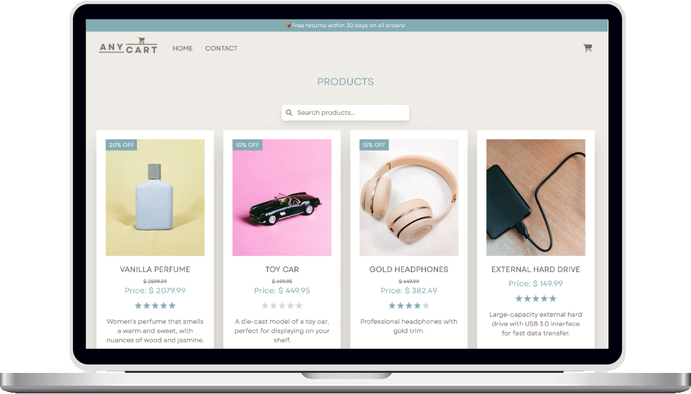

# JavaScript Frameworks - AnyCart e-commerce website



AnyCart is a fictional e-commerce platform built using React, Vite, and Tailwind CSS. The website allows users to browse, add products to the shopping cart, view discounts, and complete purchases. Dynamic product pages and seamless cart management are integrated with an API to provide real-time product data. The project is optimized for a responsive and user-friendly shopping experience on both desktop and mobile devices.

## Features
- **Product Listings: Users can view a wide selection of products, including detailed information such as price, description, and images.
- **Discounts & Pricing: Products with discounts show the discounted price, and the discount percentage is highlighted.
- **Cart Functionality: Users can add products to their cart and view the total cost, with real-time updates.
- **Product Search: A search bar allows users to filter products by category, name, or price range.
- **Responsive Design: Fully responsive, ensuring a smooth shopping experience across all devices.

## Technologies Used

- **Frontend**: React, Vite
- **Styling**: Tailwind CSS
- **Icons**: Font Awesome
- **Routing**: React Router

## Getting Started

### Installation

1. Clone the repository:

```bash
git clone https://github.com/aa096/frontend-frameworks-ca

```

2. Navigate to the project directory:

```bash
cd project-exam-2
```

3 Install the dependencies:

```bash
npm install
```

4. Run the development server:

```bash
npm run dev
```

## Contact

[My LinkedIn page](https://www.linkedin.com/in/aashild-l-rasmussen/)
